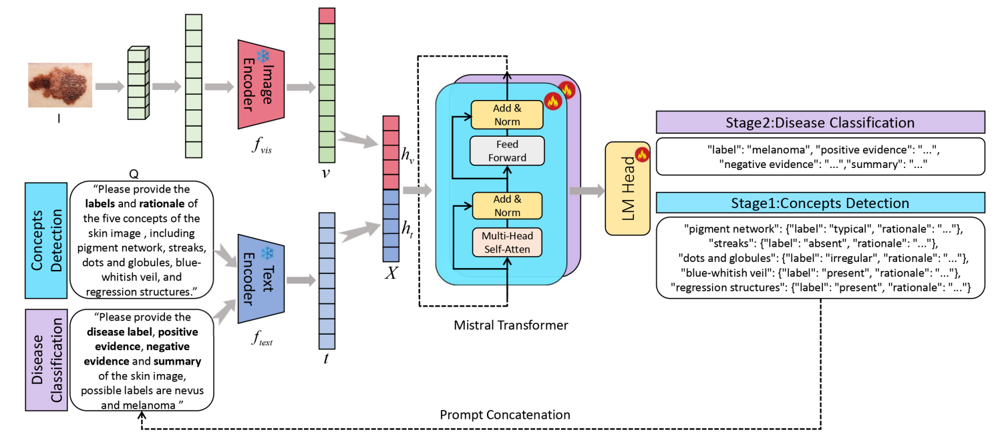

English | [中文](README_zh.md)

---

# Ex-LLaVA: Explainable Medical Image Analysis via Large Language Model

We designed a medical image analysis system based on large language models, focusing on skin disease diagnosis — particularly the distinction between nevus and melanoma. This project implements an innovative two-stage training framework: first performing skin lesion concept prediction (extracting key clinical features), then conducting disease classification based on these features, mimicking the diagnostic reasoning of dermatologists.

## Project Overview



### Demo

<video src="asset/demo.mp4" controls=""></video>

## Environment Setup

```
pip install torch==2.1.0+cu121 torchaudio==2.1.0+cu121 torchvision==0.16.0+cu121 \
    --extra-index-url https://download.pytorch.org/whl/cu121
    
pip install -r requirements.txt
```

------

## Directory Structure

```
LLaVA-Med/
├── evaluate.py          # Model evaluation script
├── evaluate.sh          # Evaluation execution script
├── finetune/            # Fine-tuning modules
│   ├── constants.py     # Constant definitions
│   ├── dataset.py       # Dataset processing
│   ├── evaluation.py    # Evaluation utilities
│   └── trainer.py       # Trainer implementation
├── finetune.sh          # Fine-tuning execution script
├── finetune_llava_med.py # Fine-tuning main entry point
├── inference.py         # Inference script
├── llava/               # Core model code
│   ├── model/           # Model architecture implementation
│   ├── serve/           # Serving-related code
│   └── utils.py         # Utility functions
├── merge_lora_weights.py # LoRA weight merging script
├── merge_weights.sh     # Weight merging execution script
└── run_inference.sh     # Inference execution script
```

## Dataset

### Image Data
- Location: `/root/autodl-tmp/data/Derm7pt`
- Contains image files from the Derm7pt skin lesion dataset

### Concept Stage Data
- Training set: `/root/autodl-tmp/data/derm7pt_concepts_train_dataset.json`
- Test set: `/root/autodl-tmp/data/derm7pt_concepts_test_dataset.json`

```
clinical_concepts_mapping={
    "pigment network": {0: "absent", 1: "typical", 2: "atypical"},
    "streaks": {0: "absent", 1: "regular", 2: "irregular"},
    "dots and globules": {0: "absent", 1: "regular", 2: "irregular"},
    "blue-whitish veil": {0: "absent", 1: "present"},
    "regression structures": {0: "absent", 1: "present"},
}
```

#### Data Format
```json
{
    "image": "/root/autodl-tmp/data/Derm7pt/{image_id}.jpg",
    "conversations": [
        {
            "from": "human",
            "value": "<image>\nAccording to this picture of skin disease, provide labels and rationales for five clinical concepts."
        },
        {
            "from": "gpt",
            "value": gpt_output
        }
    ],
    "meta": {
        "image_id": image_id,
        "split": split_name
    }
}
```

#### Concept Output Format
```json
<BEGIN_OUTPUT>
{
    "pigment network": {
        "label": "choose one from [\"absent\", \"typical\", \"atypical\"]",
        "rationale": "Explain why you chose the label for pigment network."
    },
    "streaks": {
        "label": "choose one from [\"absent\", \"regular\", \"irregular\"]",
        "rationale": "Explain why you chose the label for streaks."
    },
    "dots and globules": {
        "label": "choose one from [\"absent\", \"regular\", \"irregular\"]",
        "rationale": "Explain why you chose the label for dots and globules."
    },
    "blue-whitish veil": {
        "label": "choose one from [\"absent\", \"present\"]",
        "rationale": "Explain why you chose the label for blue-whitish veil."
    },
    "regression structures": {
        "label": "choose one from [\"absent\", \"present\"]",
        "rationale": "Explain why you chose the label for regression structures."
    }
}
<END_OUTPUT>
```

### Disease Stage Data
- Training set: `/root/autodl-tmp/data/derm7pt_concepts_train_dataset.json`
- Test set: `/root/autodl-tmp/data/derm7pt_disease_test_dataset.json`

```
clinical_class_mapping={0: "nevus", 1: "melanoma"}
```

#### Data Format
```json
{
    "image": "/root/autodl-tmp/data/Derm7pt/{image_id}.jpg",
    "conversations": [
        {
            "from": "human",
            "value": "<image>\nAccording to this picture of skin disease,provide [label, positive evidence,negative evidence,summary].Here are the concepts and their respective rationales:{information}."
        },
        {
            "from": "gpt",
            "value": gpt_output_parts
        }
    ],
    "meta": {
        "image_id": image_id,
        "split": split_name
    }
}
```

#### Disease Output Format
```json
<BEGIN_OUTPUT>
{
    "label": "nevus",   # or "melanoma"
    "positive evidence": "Explain what observable features from the image support the assigned category (nevus or melanoma).",
    "negative evidence": "Explain what features from the image rule out the reverse category (why it is not the other disease).",
    "summary": "Provide a concise rationale explaining why the assigned category is correct."
}
<END_OUTPUT>
```

## Model Architecture

### System Components
- **Vision Encoder**: CLIP ViT-Large (patch14-336), used for extracting medical image features
- **Language Model**: LoRA fine-tuned llava-med-concepts and llava-med-disease, processing text and visual features
- **Projection Layer**: Projects visual features into the language model's embedding space

### Base Model
- CLIP model: `/root/autodl-tmp/model/clip-vit-large-patch14-336`

### Fine-tuned Models
- Concept stage model: `/root/autodl-tmp/model/llava-med-concepts`
- Disease stage model: `/root/autodl-tmp/model/llava-med-disease`

## Usage

### 1. Model Fine-tuning

#### Run Fine-tuning

```bash
cd /root/LLaVA-Med

# Concept stage fine-tuning (learn skin lesion features)
bash finetune.sh concepts

# Disease stage fine-tuning (learn disease classification)
bash finetune.sh disease

# Run both stages (concepts + disease)
bash finetune.sh both
```

#### Custom Fine-tuning Parameters

The fine-tuning script supports various parameter configurations, adjustable by modifying variables in `finetune.sh`:

- **Data Paths**:
  - Base model: `/root/autodl-tmp/model/llava-med`
  - CLIP model: `/root/autodl-tmp/model/clip-vit-large-patch14-336`
  - Image folder: `/root/autodl-tmp/data/Derm7pt`
  - Training/test data: automatically selected based on task type

#### Fine-tuning Output

After fine-tuning, LoRA weights for each stage are saved at:
- Concept stage: `/root/autodl-tmp/output_concepts`
- Disease stage: `/root/autodl-tmp/output_disease`

Each output directory contains weight files organized by epoch (e.g., epoch1, epoch2), making it easy to select the best model for evaluation.

### 2. Weight Merging

Merge LoRA weights with the base model for easier deployment:

```bash
cd /root/LLaVA-Med
bash merge_weights.sh
```

This script automatically merges LoRA weights from both stages and saves them to:
- Concept stage model: `/root/autodl-tmp/model/llava-med-concepts`
- Disease stage model: `/root/autodl-tmp/model/llava-med-disease`

### 3. Model Evaluation

We provide comprehensive model evaluation capabilities, supporting detailed assessment of both concept prediction and disease classification models. The evaluation process calculates various performance metrics and saves results as structured JSON files for further analysis.

#### Evaluation Overview

- **Concept Prediction Evaluation**: Computes prediction accuracy for 5 skin lesion features:
  - Pigment network
  - Streaks
  - Dots and globules
  - Blue-whitish veil
  - Regression structures
- **Disease Classification Evaluation**: Computes classification accuracy for nevus vs. melanoma

#### Run Evaluation

```bash
cd /root/LLaVA-Med
# Evaluate concept prediction model
bash evaluate.sh --task concepts --model-path /root/autodl-tmp/model/llava-med-concepts

# Evaluate disease classification model
bash evaluate.sh --task disease --model-path /root/autodl-tmp/model/llava-med-disease
```

#### Custom Evaluation Parameters

The evaluation script supports various parameter customizations:

```bash
# Run evaluation with full parameters
bash evaluate.sh --task concepts \
  --lora /path/to/lora/weights \
  --dataset /path/to/test/dataset.json \
  --output /path/to/output/results.json \
  --model /path/to/base/model \
  --clip /path/to/clip/model \
  --device cuda \
  --temp 0.7 \
  --top-p 0.9
```

#### Evaluation Results

After evaluation, two JSON files are generated:

1. **Main results file** (e.g., `concept_evaluation_results.json` or `disease_evaluation_results.json`):
   - Total sample count, successful and failed processing counts
   - Evaluation parameter records (temperature, top_p, LoRA path, etc.)
   - Accuracy data for each concept/disease
   - Error prediction distribution statistics

2. **Prediction details file** (e.g., `concept_evaluation_results_predictions.json`):
   - Detailed prediction results for each test sample
   - Comparison of predicted labels vs. ground truth labels
   - Prediction correctness flags

### 4. Image Inference

LLaVA-Med provides a convenient command-line inference tool supporting single image analysis and batch folder processing:

#### Single Image Concept Prediction
```bash
cd /root/LLaVA-Med
./run_inference.sh --task concepts --image-path /path/to/image.jpg
```

#### Single Image Disease Classification
```bash
cd /root/LLaVA-Med
./run_inference.sh --task disease --image-path /path/to/image.jpg
```

#### Single Image Full Pipeline (Concepts + Disease)
```bash
cd /root/LLaVA-Med
./run_inference.sh --task both --image-path /path/to/image.jpg
```

**Note:** In the both stage, the disease classification model uses the concept stage analysis results as additional input. The system automatically integrates the skin lesion features and their explanations (including pigment network, streaks, dots and globules, blue-whitish veil, regression structures) generated in the concept stage into the disease classification prompt, improving diagnostic accuracy. Specifically, the system adds: "Here are the concepts and their respective rationales:{concept stage output}." to the disease classification prompt, enabling more comprehensive analysis.

#### Batch Folder Processing
```bash
# Batch process all images in a folder
cd /root/LLaVA-Med
./run_inference.sh --task both --folder-path /path/to/images/folder
```

#### Save Results to File
```bash
# Custom output filename
cd /root/LLaVA-Med
./run_inference.sh --task concepts --image-path /path/to/image.jpg --output-file result.json
```

## Output Format

### JSON Output Structure

Inference results are saved in structured JSON format with the following field order:

```json
{
  "stage": "both",
  "concepts_model_path": "/root/autodl-tmp/model/llava-med-concepts",
  "disease_model_path": "/root/autodl-tmp/model/llava-med-disease",
  "clip_path": "/root/autodl-tmp/model/clip-vit-large-patch14-336",
  "generate_text": {
    "image_id": {
      "image_path": "/path/to/image.jpg",
      "concepts": { ... },
      "disease": { ... }
    }
  }
}
```
